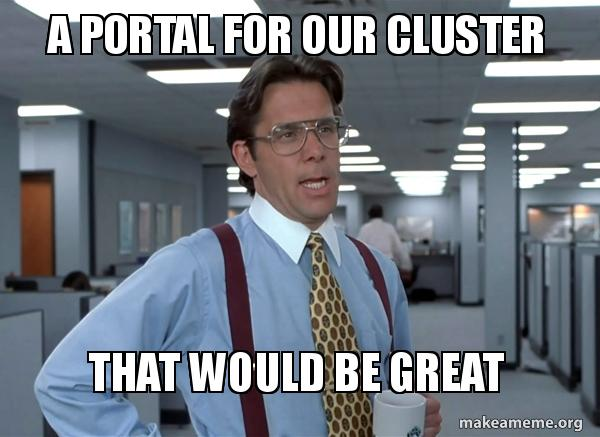

!SLIDE center subsection blue

# Clustered Applications

!SLIDE bullets

# What is a PeopleSoft Cluster?

* Multiple connected PeopleSoft environments
* Creates seamless, connected UI
* Starting 8.56+, no longer need Interaction HUB

~~~SECTION:notes~~~

~~~ENDSECTION~~~

!SLIDE bullets

# What does it get us?

* Consolidated Homepages and Tiles
* Remote Registry
* Federated Features
    * Search
    * Approvals
    * Notifications
    * User Preferences 

~~~SECTION:notes~~~

~~~ENDSECTION~~~

!SLIDE bullets

# Setting up Nodes

* "Setting up Interaction Hub..." Doc
    *  Doc ID 1545044.1
* Node config even more important 
* Both Local and Portal Host Nodes
* Set CheckToken and have a strong password/cert

~~~SECTION:notes~~~
1. In HUB (Gateway)
    1. HUB/EMPL
        1. Portal Host Node = unchecked
        1. Network NOde Name = ' '
    1. FMS
        1. Portal Host Node = checked
        1. Network NOde Name = ' '
    1. ERP
        1. Portal Host Node = checked
        1. Network NOde Name = 'FMS'
1. In FMS (Content Provider)
    1. HUB/EMPL
        1. Portal Host Node = unchecked
        1. Network NOde Name = ' '
    1. FMS
        1. Portal Host Node = checked
        1. Network NOde Name = ' '
    1. ERP
        1. Portal Host Node = checked
        1. Network NOde Name = 'FMS' 

~~~ENDSECTION~~~

!SLIDE bullets

# CheckToken

* read this...
    * https://psadmin.io/2017/10/25/understanding-the-check-token-id-in-peopletools-8-56/

~~~SECTION:notes~~~

~~~ENDSECTION~~~

!SLIDE bullets

# CheckToken

* ... or not and disable.
    * Web Profile custom property
        WebCheckToken=false
    * E-PIA: PT 8.56x SSO Troubleshooting Tips due to CheckTokenID 
        Doc ID 2427220.1

!SLIDE bullets

# IB Node Network

* More than just managing/monitoring now
* Used by different federated features
* Auto configures multiple things
    * SSO
    * Service Operations
    * Routings

~~~SECTION:notes~~~

~~~ENDSECTION~~~

!SLIDE bullets

# User Security

* Needs to be in both DBs
* Needs security to SSOTester iScript

~~~SECTION:notes~~~

~~~ENDSECTION~~~

!SLIDE bullets

# Unified Navigation

* Homepages and Tiles combine
* Recent Places
* Back Button
* Search
* Navigation

~~~SECTION:notes~~~

~~~ENDSECTION~~~

!SLIDE center subsection grey

# Demo

~~~SECTION:notes~~~

~~~ENDSECTION~~~

!SLIDE supplemental guide

# Clustered Applications Demo

## Node setup

1. PSFT_HR/EP - CheckToken setting on node 
1. ERP - Portal host node setting
1. Disable in WebProfile

## IB Node Network

1. show list, unadd FN
1. show sso setup and node routing count
1. add FM
1. show sso setup and node routing count

## Uni Nav

1. Homepage/Tile merge
    1. AP tile
    1. Show CREF name diff, but same label    
1. Remote Navigation
1. Recent Places
1. Misc Tricks
    1. Node Switch in URL
    1. Tripping cache Folder trick
    1. Migrate parent folder on CREF changes

