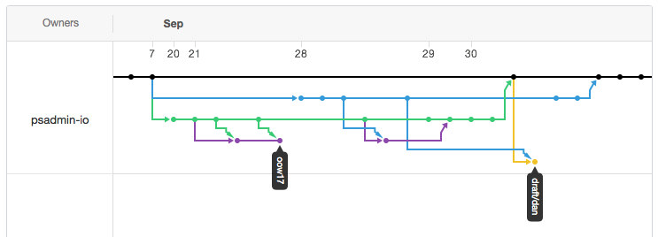

!SLIDE center subsection blue

# Git

~~~SECTION:notes~~~

Ask audience: "who uses Git?"

~~~ENDSECTION~~~

!SLIDE bullets incremental

# Git

1. Version Control Software
1. Build by Linus for Linux
1. Used everywhere, including the Windows kernel

!SLIDE bullets incremental

# Controlling DPK Changes

1. Put the DPK code into a Git repository
1. Manage changes to DPK and YAML files
1. Integrate custom DPK modules (as Git sub-modules)
1. Manage histroy

!SLIDE bullets incremental

# Git and SQR/COBOL

1. Use Git to manage PS_CUST_HOME
1. Version your `sqr` and `src` folders
1. Keep a history of changes

!SLIDE bullets incremental

# Git Branching

1. Test changes on a branch
1. Work on changes without impacting the main code line
1. Assign branches to servers

!SLIDE bullets incremental

# Collaborate

1. Share code on GitHub
1. `ps-project-git` - App Designer projects and Git
1. (Idea 12562) Support more Export to File options
1. This presentation is managed by Git and on GitHub :)

!SLIDE bullets

# Git Utilities

1. VisualStudio Code
1. GIT-POSH
1. https://git-scm.com
1. Pro-Git (online book)
1. GitLab (cloud or local)